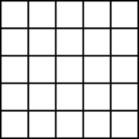
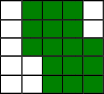
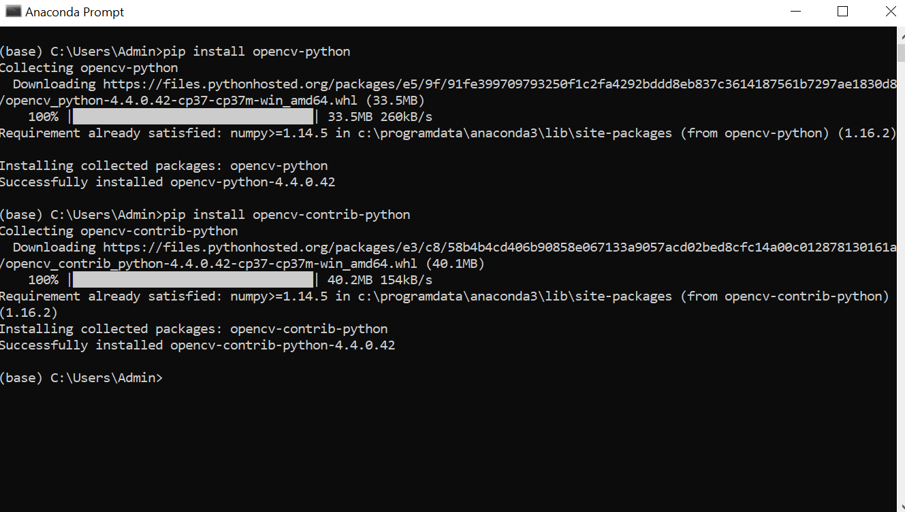
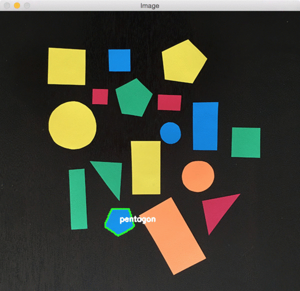

# OpenCV Basics
- **What is OpenCV?**
    
    Basically, OpenCV means **Open Source Computer Vision and Machine Learning Software** Library. As the name suggests, OpenCV has plays a major role in the field of *Computer Vision*. This is a highly optimized library that has enormous scope in *real-time applications*. The optimized algorithms which are more than 2500 in number have proved to be extremely useful in developing models of *Artificial Intelligence* and *Computer Vision*. Important aspect of OpenCV is that it's an *image processing* library that can *process* images, videos and even make use of webcams to *capture* images and videos.
- **OpenCV in Computer Vision:**
  
  **Computer Vision** is a scientific field that helps the computer to access and process digital images and videos as if it can "**see**". *Main goal* of Computer Vision is to provide the computer systems the capacity to *interpret and understand* digital images and videos at a higher level and even react to what they *see*.
  
- **Images**:

  Images are nothing but collection of *pixels*. Different values are assigned to each pixel in the image that determines its *color*. To clearly understand the concept of images, consider a *5X5 grid* that has 5 rows and 5 columns as below:
  
  
  
  If each of the rows is numbered from 1 to 5 and each of the columns is also numbered from 1 to 5, then **the color of individual blocks (i,j)** where *i represents row number and j represents column number*, can be changed that makes the grid colorful. Similarly, *pixels* of the image are assigned values to determine their colors, hence resulting in the desired image.
  
  
  
  The above image shows how some of the blocks are assigned the color "Green" to make the grid appear different. **This simpler tactic is applied in creating and processing images**. OpenCV basically processes the images by *acquiring the information of each pixel in the image and modifying it as per the requirement*. The idea behind accessing and processing videos remains the same since *videos are nothing but a sequence of images*. The quality of an image depends on the *resolution* where as quality of a video depends on the *number of frames per second*.

- **What is the importance of Image Processing and why OpenCV?**

    In modern technical world, with the advancement of technology, *digital data* in the form of *images* is of utmost importance as data can be *sent and received, stored and retrieved* in this format. "**Encryption**" is of huge interest and importance nowadays for various reasons like **security and privacy**. Encrypting data through images is most common. "**Cryptography**" aslo has widespread scope in the technical world these days. This states the importance of image processing in the modern era.
    
    Coming to image processing, OpenCV is the best library to achieve it since it allows **both image and video processing**. Along with these, it allows to capture shots from videos and thus, **obtain images from videos**. It is easily understandable which is one of the avantages for *beginners* in Computer Vision and Image Processing. OpenCV also facilitates *Denoising of noisy images* and *Histogram Equalization*. 

- **Installation of OpenCV**:
    *This section describes the installation process of OpenCV in the **Conda environment***. Installation of OpenCV requires execution of 2 commands in the *Anaconda Prompt*.
    - **Open** the *Anaconda Prompt* on the system.
    
    - **Execute** the following commands:
    
        pip install opencv-python
        
        pip install opencv-contrib-python
        
    **A snapshot of the installation is attached below:**
    
    
    
    
    After the installation, for further projects, OpenCV can be imported on the IDE using the following statement:
        import cv2
    This means, in any python script that you use OpenCV for image and video processing, it is mandatory to include the above statement in order to import the OpenCV library and use it's functions.
    
 - **Basic functions in OpenCV**:
    - ***imread()***:
        
        Looking into the basic functions in OpenCV, the first function is the *imread()* function. This function is used to load an image to a variable that can be used for further processing. 
        
        *Syntax*:
        
            variable_name = cv2.imread(location_of_the_image_to_be_loaded/name_of_the_image_to_be_loaded_with_its_extension)
            
         *Example*:
         
            img = cv2.imread("/Users/Admin/Desktop/Images/my_img.png")
            
         The above statement loads the image "**my_img.png**" in the path "**Users/Admin/Desktop/Images**" into the variable ***img***.
         
     - ***imshow()***:
     
        Displaying the loaded image is an important requirement to the users. To ensure that, the OpenCV library has an in-built function, imshow().
        
        *Syntax*:
        
            cv2.imshow(window_name , variable_name)
            
         ***OR***
            
            cv2.imshow(window_name , location_of_source_image)
            
         *Example*:
         
            cv2.imshow("Output_Image" , img)
            
         The above statement displays the image that is already loaded into the "***img***" variable on the new window named "**Output_Image**".
         
    - ***Displaying multiple images***:
    
        It is even possible to display multiple images in a single window either vertically or horizontally. This is done by importing the *numpy* library as well.
        
            import numpy as np
        
        Steps involved in displaying multiple images is as follows:
        
        - Load multiple images to multiple variables using imread() function.
        - Concatenate the images horizontally or vertically using the concatenate() function from the numpy library.
        - Display the concatenated function using imshow() function.
            
        **Syntax to concatenate 2 images**:
            variable_name = np.concatenate((image_1 , image_2) , axis = 0) #Vertical Concatenation
            
        ***OR***
            
            variable_name = np.concatenate((image_1 , image_name_2) , axis = 1) #Horizontal Concatenation
            
        Axis here refers to the mode of concatenation, i.e, horizontal or vertical. The images to be concatenated are gives as a tuple argument to the concatenate() function.
        
        **Example**:
        
            image_concatenated1 = np.concatenate((image_1 , image_2) , axis = 1) 
            image_concatenated2 = np.concatenate((image_1 , image_2) , axis = 0) 
        
        
Feel free to contact me on my [mailid](ksathyanrao@gmail.com).
        
# Contours

Basically, **Contour** can be defined as an *outline* or a *border* of any object. *Contours* in Python is a ***list*** of contours of an object, which can be an image, a frame from a video and so on. Each *Contour* in the list *Contours* is a point represented as (x , y) which represent the position of the point with respect to the two axes. The contoural points usually have the same intensity.

### Uses of Contours:

Contours are mainly **used** in ***Object Detection***. Working with contours is very handy and have application in determining the size and shape of an object. Briefly stating, Contour finds its applications in anything that involves shape analysis, object detection and recognition. 

### Functions that are used to find the contours in OpenCV:

Determining contours involves multiple steps as the image needs to get ready for the process. After reading and storing the image in a variable, the image needs to be converted to either **hsv** or **grayscale** to ease the processing.

    variable_name = cv2.cvtColor(variable_name_that_stores_the_image , cv2.COLOR_BGR2HSV)
    
***Example***:

    hsv = cv2.cvtColor(image , cv2.COLOR_BGR2HSV)
    
  The normal format of the image is **BGR** which represents the order of consideration of intensities of **Blue, Red** and **Green** in the image. **cv2.COLOR_BGR2HSV** converts the file to **hsv** which basically represents the level of **hue, saturation** and **lightness**. For obtaining **Grayscale** image, pass cv2.COLOR_BGR2GRAY as the parameter instead of cv2.COLOR_BGR2HSV.
  
  To find all the contoural points of the image, the syntax is as follows: 
  
  cv2.CHAIN_APPROX_NONE)
      
  Now, the **syntax** is:
  
      image , contours , hierarchy = cv2.findContours( image_variable , cv2.RETR_TREE , cv2.CHAIN_APPROX_SIMPLE)
      
  ***Example***:
  
      image , contours , hierarchy = cv2.findContours( image , cv2.RETR_TREE , cv2.CHAIN_APPROX_SIMPLE)
      
  The function cv2.findContours() takes 3 arguments, **source image, contour retrieval mode**, and **contour approximation method** in order. The *contour approximation* can take another value also, **cv2.CHAIN_APPROX_NONE**, but less efficient. 
  
  To obtain all the contoural points on the image, drawing the contours is necessary. To do thid the OpenCV has the drawContours() function that draws or plots all the contoural points onto the image whose **syntax** is as follows:
  
        variable_name = cv2.drawContours(image_variable , contours , -1 , (0,255,0), 3)
        
 This functions takes the arguments in the order of source image, the contours in the form of a list, and index of contours (to draw all contours, pass -1). (0,255,0) represents the colour of the contour, which here, is Green.
  
  ***Example***:
  
        image = cv2.drawContours(image , contours , -1 , (0,255,0), 3)
        
 To ensure that no noises are included, one can make use of the **for** loop to *iterate* through all the contoural points and **based on a condition**, the point can be chosen to be *plotted or discarded*.
 
 To make contouring more efficient, the **cv2.Canny()** function comes handy to ease the process for users. This function is an *integrated* function to perform all of the following tasks:
 
 - Noise Reduction
 - Finding Intensity Gradient of the image
 - Non Maximum Suppression
 - Hysteresis Thresholding
 
 This function makes the **edge detection** job done for the users so that the contouring becomes easier.
 
 **Syntax**:
 
        variable_name = cv2.Canny(image_variable , threshold_1 , threshold2) 
        
 **Example**:
 
        variable_name = cv2.Canny(image_variable , threshold_1 , threshold2) 
 
 Here, the arguments taken by the functions are **source image, first threshold for the hysteresis procedure, second threshold for the hysteresis procedure** and many more.
 
### Contouring in Video processing:

Video is undoubtedly a **series of image frames**. This concept makes video processing easier, especially when using OpenCV library. ***Contouring a video is nothing but contouring the individual frames of the video***. So, video contouring is nothing but **contouring multiple images**. To understand the *real-time application* of Contouring, contouring a webcam video is the best example.

To achieve this, 

- Access the webcam.
- Extract individual frames.
- Process the frames as if they are images to get the contours and draw them.
- Use loops wherever necessary or break statements and conditions.

*This markdown is written by: Sathyashree*. 

***Feel free to contact me on my [mailid](ksathyanrao@gmail.com).***

# Shape Detection

### Introduction:

Basically ***Shape Detection*** is nothing but **finding** different shapes in an image and **identifying** them. Using OpenCV, computers can be made able to detect shapes in an image by feeding them with some information and applying certain conditions and allow them to act based on the decision. This process involves *multi-steps*.

- *Installing* ***pip*** and ***imutils*** **packages**.
- *Importing* the necessary **libraries**.
- *Creating* the ***ShapeDetector*** **class**.
- *Loading* and *processing* the image and *finding* the contours.
- *Finding* the **center of each contour** and detecting the shape.
- *Displaying* the **output image**.

### Code Description:

Now, let's dive into the actual code of the topic. 

#### *Installing* ***pip*** and ***imutils*** **packages**:

The below-stated statements enable the user to *install* **pip** and **imutils** packages in the **conda environment**.

    conda install pip
    pip install imutils
    
#### *Importing* the necessary **libraries**:

Coming to the libraries that are used in this procedure, one needs to import **cv2** and **imutils**.

    import cv2
    import imutils
 
#### *Creating* the ***ShapeDetector*** **class**:

The tricky part of the code starts. Let's start coding!!!

To summarize the ***ShapeDetector*** class, it is a class that we define to *detect* the shape of a **Contour**. The **constructor** has no role to play since the object of thus class *doesn't* need any **initialization**. 

    class ShapeDetector:
        def __init__(self):
            pass
        
 The member function or the ***method*** **detect(self , c)** takes a contour as an argument, processes it to determine the shape of the contour. The shape of the contour is initially "unidentified". Then, the **perimeter** of the contour is calculated using the *cv2.arcLength()* function. Then, the contour is **approximated** using the *cv2.approxPolyDP()* function that takes the contour as the first argument and the second parameter is normally in the range of **1-5%** of the original perimeter of the contour. The approximation is based on the idea that a *series of short line segments* can approximate a **curve** and the resulting curve consists of a **subset of the originally defined points**. This *approximation* gives us the **number of vertices**.
 
        def detect(self , c):
            shape = "unidentified"
            peri = cv2.arcLength(c , True)
            approx = cv2.approxPolyDP(c , 0.04 * peri , True)
 
 Once the number of vertices are known, the shape identification process is easier and based on few *conditions*. The series of conditions include checking if the contour has *3 vertices or 4 or 5 or none*. *3* vertices represent that the shape is a *Triangle*; *4* vertices mean its a *Rectangle* or a *Square*; *5* means its a *Pentagon*; *none* inflicts the idea that it should be a *circle*. The *shape* of the contour is **returned**.
    
            if len(approx) == 3:
                shape = "Triangle"
            elif len(approx) == 4:
                (x , y , w , h) = cv2.boundingRect(approx)
                av = w / float(h)
                shape = "Square" if av >= 0.95 and av <= 1.05 else "Rectangle"
            elif len(approx) == 5:
                shape = "Pentagon"
            else:
                shape = "Circle"
            return shape

The idea behind determining if the shape is a square or a rectangle is that the **ratio** of the *width to the height* of a **square** is **approximately equal to 1**. An **approximated rectangle** is drawn around the contoural points using the *cv2.boundingRect()* function and then, the *ratio* of the width to the height is found out.  If the value of the *ratio falls around 1*, then the shape is a *Square*, else a *Rectangle*.

#### *Loading* and *processing* the image and *finding* the contours:

After the class definition is *done*, image **loading and processing** is required to utilize the function that is already defined. The image which contains different shapes is **read and loaded to a variable**. To ease the process of shape detection, the image needs a little processing to make the process of finding contours easier that makes a few steps. Fiest, the image is resized using the imutils.resize() function to enable *better approximation* of the contours. In future process, the factor by which the iamge is resized is of importance, because of which the ratio is found out and stored in a variable. 

    image = cv2.imread('shapes_and_colors.jpg')
    resized = imutils.resize(image, width=300)
    ratio = image.shape[0] / float(resized.shape[0])
    
The resized image is then **converted** into **Grayscale** by using *cv2.cvtColor()* function. Then the Grayscaled image is **blurred** using *cv2.GaussianBlur()* function and at last **thresholded**. Thresholding is basically assigning the pixel values in relation to the threshold value provided where each pixel value is compared with the threshold value. This is done using the *cv2.threshold()* function. These are the basic processes involved before finding the contours of an image.

    gray = cv2.cvtColor(resized , cv2.COLOR_BGR2GRAY)
    blurred = cv2.GaussianBlur(gray , (5 , 5) , 0)
    thresh = cv2.threshold(blurred , 60 , 255 , cv2.THRESH_BINARY)[1]
 
After the image is ready, the thresholded copy is used to **find the contours** using the *cv2.findContours()* function and *imutils.grab_contours()* function. After this, an *object* for the ShapeDetector class is **created**.

    cnts = cv2.findContours(thresh.copy() , cv2.RETR_EXTERNAL , cv2.CHAIN_APPROX_SIMPLE)
    cnts = imutils.grab_contours(cnts)
    sd = ShapeDetector()

#### *Finding* the **center of each contour** and detecting the shape:

This phase needs the script to **iterate** through all the contours obtained. Each contour undergoes a series of statements, first one being the *finding of the **moments***. Image moment is a *weighted average* of the **image pixels' intensities**, usually chosen to have some *attractive property* or *interpretation*. Then, the *x* and *y* co-ordinates of the **center of the contour** is calculated. This basically is finding the **centroid** of the contour. The center is identified to enable **naming** the shape in the later part of the code.

    for c in cnts:
        M = cv2.moments(c)
        cX = int((M["m10"] / M["m00"]) * ratio)
        cY = int((M["m01"] / M["m00"]) * ratio)
        
Using the contour, the *shape* of the contour is obtained by calling **detect()** method defined in the **ShapeDetector** class on the object previously created. The contour value undergoes few changes like *conversion* to **float**, *multiplication* by the **ratio** to *find* the **actual position** of the respective contour in the *original image* and *conversion* to **int**.
        
        shape = sd.detect(c)
        c = c.astype("float")
        c *= ratio
        c = c.astype("int")
 
 Now, *draw* the **contour** of the shape on the ***original image*** and *name* the **shape**. This is just a 2 line code and uses simple functions like **cv2.drawContours()** and **cv2.putText()**.
        
        cv2.drawContours(image , [c] , -1 , (0 , 255 , 0) , 2)
        cv2.putText(image , shape , (cX , cY) , cv2.FONT_HERSHEY_SIMPLEX , 0.5 , (255 , 255 , 255) , 2)
    
#### *Displaying* the **output image**:

This is the *final* step for a contour that has been *drawn* and *named* with its shape in the **current loop**. The contour on the image that has been identified and marked is *displayed*. This uses the simple *cv2.imshow()* function.

        cv2.imshow("Image", image)
        cv2.waitKey(0)
        
This is the end of the code. 

Note:

- *Finding* the **center of each contour** and detecting the shape.
- *Displaying* the **output image**.

These are the *2 phases* that **repeat on loop** for the contours. These steps work for each contour in the contours' list and repeat until *all the contours* are **marked, identified and displayed** on the window. After all the shapes are detected and displayed, the user can close the window.

Consider the following *image*:

After detecting the shapes of all contours, the *output image* is: 

Written by: Sathyashree

Feel free to contact me on my [mailid](ksathyanrao@gmail.com). !!!
